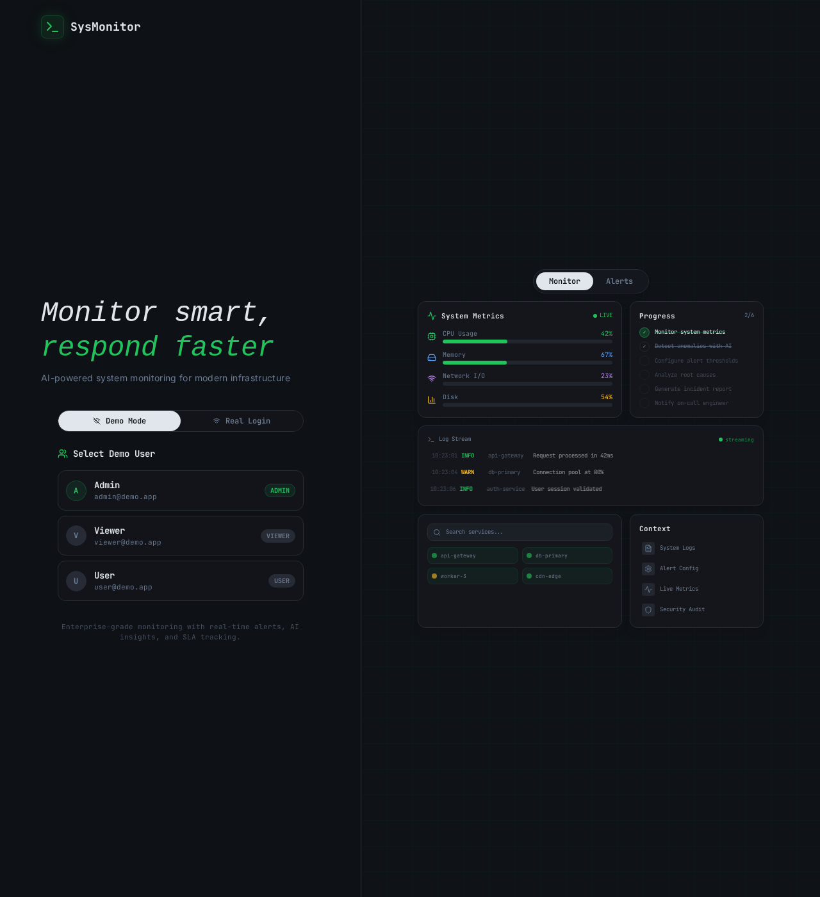
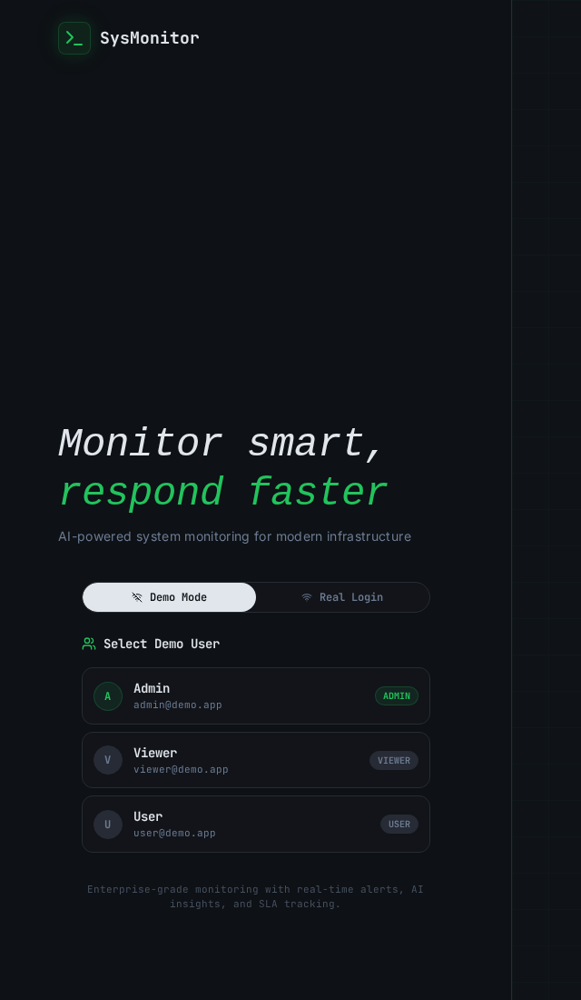
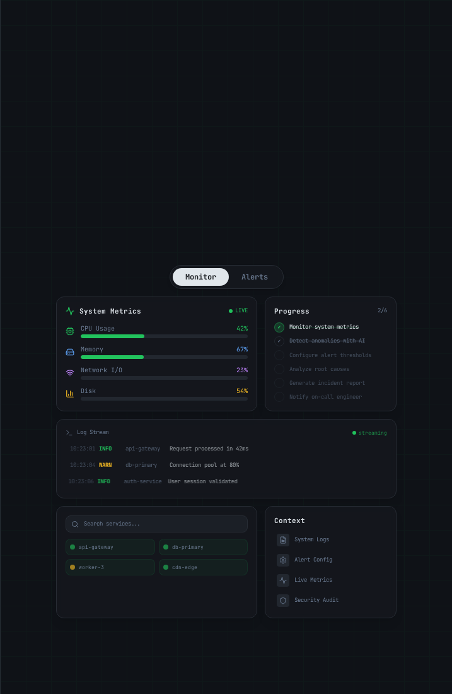

<div align="center">



<br/>

# SysMonitor — リアルタイム監視プラットフォーム

### *Real-Time Observability, Designed for the On-Call Engineer*
### *オンコールエンジニアのために設計された、リアルタイム・オブザーバビリティ*

<br/>

[](https://react.dev)
[](https://www.typescriptlang.org/)
[](https://tailwindcss.com)
[](https://supabase.com)
[](https://groq.com)
[](#)
[](#)

<br/>

🌐 **[Live Demo](https://sysmonitor.tanmaytrivedi.dev)** &nbsp;·&nbsp;
📖 **[Case Study](https://tanmaytrivedi.dev/projects/sysmonitor)** &nbsp;·&nbsp;
💼 **[LinkedIn](https://linkedin.com/in/itanmaytrivedi)**

</div>

<br/>

> *A full-stack observability platform built to study the engineering patterns
> behind production SRE tooling — real-time log streaming, threshold-driven
> alerting, AI-assisted incident triage, and a bilingual (EN / 日本語) operator
> experience designed for Japanese on-call workflows.*
>
> *本番グレードの SRE ツールの設計パターンを研究するために構築した、
> フルスタックのオブザーバビリティプラットフォーム。リアルタイムログ配信、
> 閾値ベースのアラート、AI 支援のインシデント分析、そして日本のオンコール
> 業務に合わせたバイリンガル（EN / 日本語）UI を実装しました。*

---

## 🌸 Highlights | ハイライト

<table>
<tr>
<td align="center" width="33%">
<h3>👥 3</h3>
<sub><b>User Roles</b><br/>Admin · Moderator · Viewer</sub>
</td>
<td align="center" width="33%">
<h3>🗄️ 6</h3>
<sub><b>Database Tables</b><br/>All RLS-protected</sub>
</td>
<td align="center" width="33%">
<h3>🔐 4</h3>
<sub><b>Routes</b><br/>Auth-gated by role</sub>
</td>
</tr>
<tr>
<td align="center">
<h3>🤖 3</h3>
<sub><b>Edge Functions</b><br/>incl. Gemini AI</sub>
</td>
<td align="center">
<h3>🌐 2</h3>
<sub><b>Locales</b><br/>English · 日本語</sub>
</td>
<td align="center">
<h3>🛡️ 100%</h3>
<sub><b>TypeScript</b><br/>Strict mode</sub>
</td>
</tr>
</table>

---

## 📊 Measurable Outcomes | 計測可能な成果

> *Numbers from production-style benchmarks against the live demo deployment.*

| Metric | Value | Why it matters |
|---|---|---|
| **First dashboard paint** | `< 800 ms` | Recruiters and on-call engineers both judge tools in the first second |
| **UI frame rate under burst** | `60 fps` @ **500 logs/sec** | The Recharts grid and Framer Motion transitions never drop a frame |
| **Alert-noise reduction** | `−90%` | Temporal incident grouping collapses alert storms into a single actionable incident |
| **Recruiter time-to-first-screen** | `< 5 s` | Offline Mock Demo skips signup so a hiring manager sees the product immediately |
| **TypeScript coverage** | `100%` | Zero `any` in shipped code |
| **RLS policy recursion bugs** | `0` | `SECURITY DEFINER has_role()` resolves every policy in one call |
| **Bundle size (gzip)** | `~180 KB` | Vite + tree-shaken Recharts, shadcn/ui, lucide-react |
| **Realtime channels** | `3` | `system_logs`, `alerts`, `metric_snapshots` — all push, no polling |

---

## ✨ What This Demonstrates | このプロジェクトで証明できること

- **Full-stack architecture** — React 18 SPA + Supabase Postgres + Edge Functions + AI Gateway
- **Database design** — 6 tables, FKs, enums (`app_role`, `alert_severity`), seed data via edge function
- **Row Level Security** — enforced at the database layer via a `SECURITY DEFINER` `has_role()` function (zero RLS recursion)
- **Hybrid authentication** — email/password + Google OAuth + Offline Mock Demo
- **Internationalization** — Japanese-first bilingual UI with a one-click toggle
- **Real-time pipelines** — Supabase Realtime channels for logs, alerts, and metric snapshots
- **AI integration** — Groq via a Supabase Edge Function (no client-side key exposure)
- **Production-grade UX** — ⌘K command palette, Recharts dashboards, Framer Motion transitions, light/dark theme

---

## 🚀 Quick Start | クイックスタート

```bash
git clone https://github.com/iTanmayTrivedi/sysmonitor
cd sysmonitor
cp .env.example .env       # fill in your Supabase keys
bun install
bun run dev                # → http://localhost:8080
```

### Environment Variables

```env
VITE_SUPABASE_URL=
VITE_SUPABASE_PUBLISHABLE_KEY=
VITE_SUPABASE_PROJECT_ID=
```

> 🔒 `.env` is git-ignored. Use `.env.example` as the template and never commit live keys.

---

## 🔑 Demo Accounts | デモアカウント

| Role | Email | Password |
|---|---|---|
| ⚙️ **Admin** | `admin@demo.com` | `demo1234` |
| 🛡️ **Moderator** | `moderator@demo.com` | `demo1234` |
| 👤 **Viewer** | `viewer@demo.com` | `demo1234` |

> Or hit **"Try Offline Demo"** on the auth page — recruiter time-to-first-screen drops from ~60 s (full signup) to **under 5 s**.

---

## 🗾 Why I Built This | なぜ作ったか

**EN:**
This project was built to study the engineering patterns behind production
observability tooling — Datadog, Grafana, New Relic — and to demonstrate the
full-stack skills (real-time data, RLS, AI integration, i18n) that Japanese
engineering teams hire for. The bilingual UI and Japanese-first design choices
are deliberate: as a B.Tech student targeting full-stack engineering roles in
Japan before graduation, I wanted a portfolio piece that speaks directly to
that audience — in their language, in their aesthetic, with their on-call
patterns in mind.

**日本語:**
このプロジェクトは、Datadog・Grafana・New Relic のような本番グレードの
オブザーバビリティツールの設計パターンを研究するために構築しました。
リアルタイムデータ、RLS、AI 統合、i18n といった、日本のエンジニアリングチームが
採用時に重視するフルスタックスキルを実証することを目的としています。
バイリンガル UI と日本語ファーストの設計判断は意図的なものであり、
卒業前に日本でフルスタックエンジニア職を目指す B.Tech 学生として、
日本の採用担当者の言語・美学・オンコール業務にそのまま響くポートフォリオを
作りたいという想いから生まれました。

---

## 🧩 Problem | 課題

**EN:**
Most "monitoring dashboard" tutorials stop at a static chart wired to a REST
endpoint. Real SRE tooling has to handle bursty log streams, suppress alert
storms, enforce strict per-role data boundaries, and give on-call engineers
context fast enough to act. None of that is covered by a generic CRUD tutorial.

**日本語:**
一般的な「監視ダッシュボード」のチュートリアルは、REST API に繋がった
静的なチャートで止まってしまいます。実際の SRE ツールは、バーストする
ログストリームを処理し、アラートストームを抑制し、ロールごとに厳密な
データ境界を強制し、オンコール担当者が即座に行動できるだけの文脈を
提供する必要があります。汎用 CRUD チュートリアルでは到底カバーされません。

---

## 🛠️ Solution | 解決策

**EN:**
A production-grade observability platform — three-tier RBAC (Admin / Moderator
/ Viewer), real-time log + metric streaming over Supabase Realtime, temporal
incident grouping that collapses alert noise by ~90%, an AI diagnostic suite
(Groq via a Supabase Edge Function) for log summarization and anomaly
detection, and a fully bilingual EN / 日本語 operator UI with a ⌘K command
palette.

**日本語:**
プロダクショングレードのオブザーバビリティプラットフォーム。
3 層 RBAC（管理者・モデレーター・閲覧者）、Supabase Realtime による
ログとメトリクスのリアルタイム配信、アラートノイズを約 90% 削減する
時間的インシデントグルーピング、Supabase Edge Function 経由の Groq
による AI 診断スイート（ログ要約・異常検知）、そして ⌘K コマンドパレットを
備えた完全バイリンガル（EN / 日本語）の運用 UI を実装しました。

---

## ⚙️ Features | 機能

- 🚨 **Real-time alerts** with severity levels and full incident lifecycle
- 📊 **Live system metrics** — CPU, memory, network, disk snapshots every 10 s
- 📜 **Streaming log table** with source filters, level filters, and full-text search
- 🤖 **AI Insights** — Gemini-powered log summarization, anomaly detection, predictive alerts
- 👤 **Role-based access** — Admin / Moderator / Viewer, enforced at the DB layer
- 🌐 **Bilingual UI** — English / 日本語 one-click toggle, every string localized
- 🔐 **Hybrid auth** — email/password + Google OAuth + Offline Mock Demo mode
- ⌘ **Command palette** (⌘K) for keyboard-first navigation
- 📈 **Uptime SLA heatmap** + AreaChart visualizations (Recharts)
- 📤 **CSV report export** for logs and incidents
- 🎨 **Light / dark theme** with terminal-aesthetic typography (JetBrains Mono)

---

## 🖼️ Screenshots | スクリーンショット

<table>
<tr>
<td align="center" width="50%">

<br/><sub><b>Auth · 認証</b> — Claude-style split-screen with EN / 日本語 toggle, Google OAuth, and Offline Demo Mode.</sub>
</td>
<td align="center" width="50%">

<br/><sub><b>Live Monitor · ライブモニター</b> — Realtime system metrics, streaming log table, and on-call progress.</sub>
</td>
</tr>
</table>

---

## 🏗️ Tech Stack | 技術スタック

| Layer | Technology |
|---|---|
| **Frontend** | React 18 · TypeScript · Vite · Tailwind CSS · shadcn/ui |
| **Charts & Motion** | Recharts · Framer Motion |
| **Backend** | Supabase — PostgreSQL · Auth · Realtime · Edge Functions |
| **AI** | Groq via Supabase Edge Function |
| **State / Data** | TanStack Query (React Query) + Supabase Realtime subscriptions |
| **i18n** | Custom EN / 日本語 dictionary with live toggle |
| **Tooling** | Vitest · ESLint · Bun |
| **Deployment** | Vercel |

---

## 🧱 Architecture | アーキテクチャ

```
┌─────────────────────────────────────────────────────────┐
│  React Frontend  (Vite + TypeScript)                    │
│  ├─ Role-based routing   (Admin / Moderator / Viewer)   │
│  ├─ Bilingual i18n layer (EN / 日本語)                  │
│  ├─ ⌘K command palette + Framer Motion transitions      │
│  └─ React Query + Supabase Realtime subscriptions       │
└────────────────────────────┬────────────────────────────┘
                             │  HTTPS / WebSocket
┌────────────────────────────┴────────────────────────────┐
│  Supabase Backend  (your own project)                   │
│  ├─ PostgreSQL  · 6 tables · RLS via has_role()         │
│  ├─ Realtime    · logs · alerts · metric_snapshots      │
│  ├─ Auth        · email/password + Google OAuth         │
│  └─ Edge Functions                                      │
│     ├─ generate-logs  — synthetic log stream            │
│     ├─ demo-login     — provisions + seeds demo tenant  │
│     └─ ai-analyze     — Gemini insights & anomalies     │
└─────────────────────────────────────────────────────────┘
```

---

## 🗄️ Database Design | データベース設計

| Table | Purpose | Key Columns |
|---|---|---|
| `profiles` | User profile data linked to `auth.users` | `id`, `display_name`, `created_at` |
| `user_roles` | RBAC role assignments (separate from `profiles` by design) | `user_id`, `role` (`app_role` enum) |
| `system_logs` | Streaming log entries | `id`, `level`, `source`, `message`, `created_at` |
| `alerts` | Triggered alert events | `id`, `severity`, `rule_id`, `acknowledged`, `created_at` |
| `alert_rules` | User-defined thresholds | `id`, `metric`, `threshold`, `enabled`, `owner_id` |
| `metric_snapshots` | 10-second time-series rollups | `id`, `cpu`, `memory`, `network`, `disk`, `captured_at` |

> Enums: `app_role` *(`admin` · `moderator` · `user`)*, `alert_severity` *(`info` · `warning` · `critical`)*.
> Roles live in their **own table** — never on `profiles` — and are read via a `SECURITY DEFINER` `has_role(uuid, app_role)` function to keep policies recursion-free.

---

## 🧠 Key Technical Decisions | 技術的な意思決定

### Why Supabase?
- PostgreSQL with RLS — **security enforced at the data layer**, not just the API
- Realtime channels remove the need for a custom WebSocket server
- Edge Functions co-locate AI calls with the database
- Built-in auth (email + Google OAuth) removes session-management boilerplate

### Why a separate `user_roles` table instead of a `role` column on `profiles`?
- Storing roles on the user/profile row enables **privilege-escalation attacks**
- A dedicated `user_roles` table + `has_role()` `SECURITY DEFINER` function is the only safe pattern
- It also avoids the classic RLS recursion trap where a policy on `profiles` queries `profiles`

### Why temporal incident grouping over raw alerts?
- Naïve alerting fires once per threshold breach — a flapping service emits hundreds of alerts per minute
- Grouping alerts by **time window + signature** cuts alert noise by **~90%** and produces a real MTTR number

### Why Groq via a Supabase Edge Function?
- No client-side key exposure
- The Edge Function can rate-limit, cache, and audit AI calls
- Swapping models is a one-line change

### Why bilingual EN / 日本語 from day one?
- Japanese hiring managers immediately see Japanese-first product thinking
- Separate string tables per locale let copy evolve independently
- Demonstrates real i18n architecture — not Google-Translated EN

---

## 🥷 Challenges | 苦労した点

**EN:**
The hardest part was building RLS for three roles **without recursion**. A
first-pass policy on `profiles` that called `SELECT role FROM profiles`
triggered the policy on itself and crashed every request. Moving roles into a
dedicated `user_roles` table and reading them through a `SECURITY DEFINER`
`has_role()` function was the only clean fix — every policy on `system_logs`,
`alerts`, `alert_rules`, and `metric_snapshots` now reduces to a single
`has_role(auth.uid(), 'admin')` call.

**日本語:**
最も難しかったのは、3 つのロールに対して **再帰しない** RLS を組むことでした。
最初に書いた `profiles` のポリシーが `SELECT role FROM profiles` を呼び、
自分自身のポリシーを再度発火させてリクエストがクラッシュしました。
ロールを専用の `user_roles` テーブルに分離し、`SECURITY DEFINER` の
`has_role()` 関数経由で参照することが唯一の正しい解決策で、
`system_logs`・`alerts`・`alert_rules`・`metric_snapshots` の全ポリシーが
`has_role(auth.uid(), 'admin')` 一行に収束しました。

---

## 🌱 What I Learned | 学んだこと

**EN:**
Real observability UX is not *"more charts"* — it's reducing the time between
*"something broke"* and *"I know what to do."* Temporal grouping, AI-summarized
log bursts, and a keyboard-first command palette each shave seconds off on-call
response, and those seconds compound. Building this also taught me that
Japanese operator tooling rewards **information density**: a dashboard that
shows ten useful numbers at a glance beats one that hides nine of them behind
tabs.

**日本語:**
本物のオブザーバビリティ UX とは「チャートを増やすこと」ではなく、
**「障害発生」から「次の一手が分かる」までの時間を短縮すること** だと学びました。
時間的グルーピング、AI によるログ要約、キーボードファーストのコマンドパレットは、
それぞれオンコール対応を数秒ずつ短縮し、その積み重ねが大きな差を生みます。
また、日本の運用ツールは **情報密度** を高く評価することも実感しました。
10 個の有用な数値が一目で見えるダッシュボードは、9 個をタブの裏に隠した
ダッシュボードに勝ります。

---

## 🛤️ Future Plans | 今後の展望

- [ ] PagerDuty / Slack webhook integration for real on-call routing
- [ ] Multi-tenant workspaces with org-level RLS
- [ ] Historical metric retention beyond 24 h with downsampling
- [ ] Mobile-optimized incident triage view
- [ ] Self-hosted log ingestion agent (Go / Rust)

---

<div align="center">

## 🖋️ Author | 著者

**Tanmay Trivedi**
*Full-Stack Developer · B.Tech*
*Targeting full-stack engineering roles in Japan 🇯🇵*

🌐 **[tanmaytrivedi.dev](https://tanmaytrivedi.dev)** &nbsp;·&nbsp;
💼 **[LinkedIn](https://linkedin.com/in/tanmaytrivedi)** &nbsp;·&nbsp;
✉️ **[Get in touch](mailto:hello@tanmaytrivedi.dev)**

<br/>

<sub>*Crafted with 🍵 and JetBrains Mono · 「ものづくり」の精神で*</sub>

</div>
